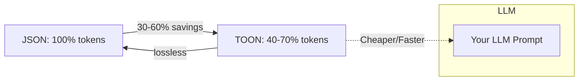
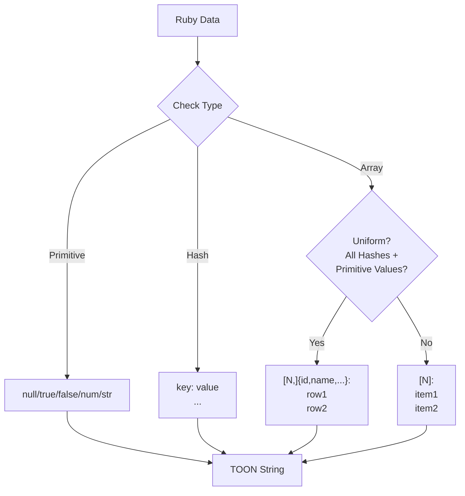
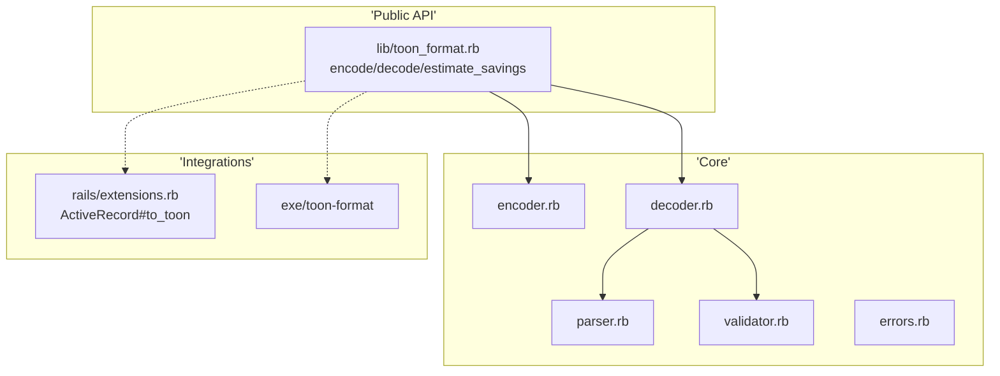

# Toon Format 🖼️📦

[](https://rubygems.org/gems/toon-format)
[](LICENSE.txt)
[](https://www.ruby-lang.org/)
[](https://github.com/osmanok/toon-format/actions)
[](coverage/index.html)

A **Ruby gem** implementing [TOON (Token-Oriented Object Notation)](https://github.com/toon-format/spec) – the compact, human-readable serialization format that slashes **LLM token usage by 30-60%** vs JSON while staying **lossless**.

Perfect for API responses, database exports, and LLM prompts!

> 💡 **Inspired by**: This gem is based on the [TOON format specification](https://github.com/toon-format/toon) and provides a complete Ruby implementation.

## 🚀 Why TOON Format?



**Key Wins:**
- 🏆 **Token Reduction**: 30-60% fewer tokens for LLM contexts
- 🔄 **Bidirectional**: `encode`/`decode` with 100% round-trip fidelity
- 📊 **Smart Tabular Arrays**: Auto-optimizes uniform data (e.g., DB records)
- 🛡️ **Secure by Design**: Depth limits, circular refs, no `eval`
- ⚡ **Fast**: ~2x JSON speed
- 🎛️ **CLI + Rails**: Ready for production

## 📦 Installation

**Requirements:**
- Ruby 3.0 or higher
- Tested on Ruby 3.0, 3.1, 3.2, 3.3, 3.4

**Add to your Gemfile:**
```ruby
gem 'toon-format'
```

**Then install:**
```bash
bundle install
```

**Or install directly:**
```bash
gem install toon-format
```

## ⚡ Quick Start

```ruby
require 'toon_format'

# Encode
data = { name: 'Alice', age: 30 }
toon = ToonFormat.encode(data)
# => "name: Alice\nage: 30"

# Decode
original = ToonFormat.decode(toon)
# => {:name=>"Alice", :age=>30}

# Tabular magic ✨
users = [{id:1, name:'Alice'}, {id:2, name:'Bob'}]
ToonFormat.encode(users)
# => "[2,]{id,name}:\n1,Alice\n2,Bob"
```

## 🛠️ How It Works: Encoding Flow



## 🏗️ Architecture



## ✨ Advanced Usage

### Token Savings Estimator
```ruby
stats = ToonFormat.estimate_savings(data)
# => {json_tokens: 1234, toon_tokens: 789, savings_percent: 36.1}
```

### Custom Options
```ruby
ToonFormat.encode(data, delimiter: '|', indent: 4, length_marker: false)
```

### Strict Decoding
```ruby
ToonFormat.decode(toon, strict: false)  # Skip validation
```

## 🚂 Rails Integration

Auto-extends ActiveRecord:
```ruby
user.to_toon(only: [:id, :name])
```

## 🔧 CLI Tool

```bash
# Encode JSON → TOON
toon-format encode data.json > data.toon

# Decode
toon-format decode data.toon > data.json

# Stats
toon-format stats data.json
# JSON: 1,234 tokens | TOON: 789 | Savings: 36.1%

# Pipe it!
cat api.json | toon-format encode
```

**Options:** `--output FILE --no-strict --delimiter '|' --indent 4 --no-length-marker`

## 📈 Benchmarks

### Quick Results

| Scenario | Speed vs JSON | Token Savings |
|----------|--------------|---------------|
| Tabular Data (100 records) | 2-3x faster | **~52%** 🎯 |
| Simple Objects | 1-2x faster | ~14% |
| Nested Structures | Similar | ~22% |
| Large Datasets (1000+) | 1.5-2x faster | **40-70%** 🚀 |

### Comprehensive Benchmark Suite

We have **11 specialized benchmarks** covering:

- ⚡ **Performance**: Encode/decode speed, scalability (1-10k records)
- 📊 **Comparisons**: vs JSON, YAML, MessagePack, CSV
- 🌍 **Real-World**: API responses, DB exports, LLM contexts
- 🔍 **Advanced**: Memory usage, validation overhead, deep nesting
- 🔄 **Fidelity**: Round-trip tests, data integrity

**Run all benchmarks:**
```bash
ruby benchmark/run_all_benchmarks.rb
```

**Run individual benchmarks:**
```bash
ruby benchmark/token_reduction_benchmark.rb  # Token savings
ruby benchmark/scalability_benchmark.rb      # 1-10k records
ruby benchmark/real_world_benchmark.rb       # Practical scenarios
ruby benchmark/format_comparison_benchmark.rb # vs other formats
```

See [benchmark/README.md](benchmark/README.md) for details.

## 🛡️ Security

- `MAX_DEPTH=100`
- `MAX_ARRAY_SIZE=100_000`
- Circular reference detection
- UTF-8 validation
- No `eval`

## 📊 Status

- ✅ **v0.1.0**: Core features + 83% coverage (42+ specs)
- 🔄 **Next**: Complex nesting, 95% coverage

## 🤝 Contributing

1. Fork & clone
2. `bin/setup`
3. `bundle exec rspec`
4. `bundle exec rubocop -a`
5. PR away! 🎉

See [CONTRIBUTING.md](CONTRIBUTING.md) for guidelines.

## 🌐 Resources & Links

### TOON Format
- 📖 [TOON Format Repository](https://github.com/toon-format/toon) - Original TOON format
- 📋 [TOON Specification](https://github.com/toon-format/spec) - Format specification
- 💎 [This Ruby Implementation](https://github.com/osmanok/toon-format)

### This Gem
- 📝 [Changelog](CHANGELOG.md)
- 🤝 [Contributing](CONTRIBUTING.md)
- 📊 [Benchmarks](benchmark/README.md)
- 🏗️ [Architecture](CLAUDE.md)

## 🙏 Acknowledgments

This gem is inspired by and implements the [TOON format specification](https://github.com/toon-format/toon), created to optimize token usage for LLM contexts. Special thanks to the TOON format community for developing this innovative serialization approach.

## 📄 License

[MIT](LICENSE.txt)

⭐ **Star on GitHub** & try it in your LLM pipelines! 🚀
